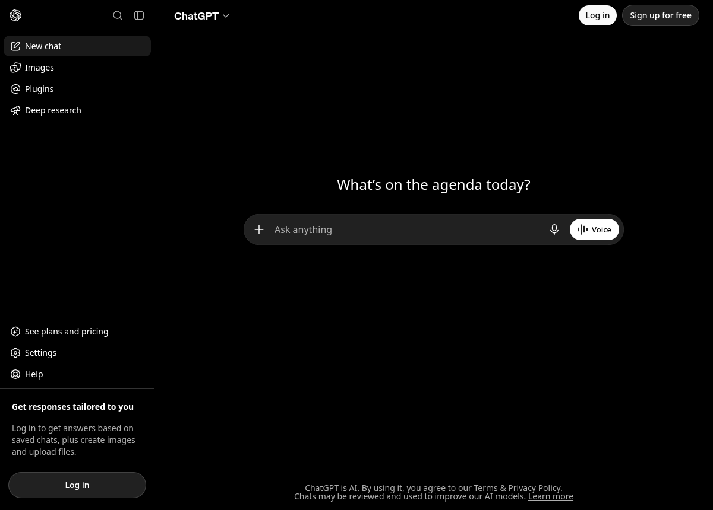

# chatgpt-linux

An unofficial ChatGPT desktop app for Linux.

OpenAI ships desktop apps for macOS and Windows. Linux only gets a "notify me"
form. This is a small, auditable Electron shell around `chatgpt.com` that makes
it behave like a real desktop app: its own window and icon, a tray, a persistent
login, and links that open in your browser instead of hijacking the app frame.



## What it is (and isn't)

It **is** a wrapper. The UI you see is `chatgpt.com`, rendered by Chromium. That
is deliberate — it means nothing breaks when OpenAI ships a change, and there is
no repackaged binary to trust.

It is **not** affiliated with or endorsed by OpenAI, and it is not a repackaging
of their macOS build. You need your own ChatGPT account.

## Features

- Dedicated window, app icon, and `.desktop` entry
- Stays logged in across restarts (persistent Chromium profile)
- System tray — closing the window hides it, launching again brings it back
- Single instance: a second launch focuses the running window
- Voice mode works (microphone permission is granted; everything else is denied)
- Links to other sites open in your default browser, never in the app frame
- Sign-in with email or phone works — the app presents a plain Chrome
  user agent, because identity providers reject anything advertising Electron
- Spell checking (English + Norwegian by default) with a right-click menu
- Remembers window size, position, and zoom level
- Global hotkey to show/hide (`Ctrl+Alt+G` by default)
- No bundled Chromium: runs on the system Electron, so the install is ~1 MB
- Zero npm dependencies

## Install

### Arch / CachyOS / Manjaro

```bash
git clone https://github.com/franzjeger/chatgpt-linux.git
cd chatgpt-linux/packaging
makepkg -si
```

### Any other distro

Install Electron 43 from your package manager (or `npm i -g electron@43`), then:

```bash
git clone https://github.com/franzjeger/chatgpt-linux.git ~/.local/share/chatgpt-linux
electron ~/.local/share/chatgpt-linux
```

To get a menu entry, copy `packaging/chatgpt-linux.desktop` to
`~/.local/share/applications/` and adjust its `Exec=` line to the above.

## Run from source

```bash
git clone https://github.com/franzjeger/chatgpt-linux.git
cd chatgpt-linux
npm start
```

`npm start` runs `electron .`, so it needs an `electron` binary on your `PATH`.
There is nothing to `npm install` — the app has no dependencies.

## Configuration

Settings live in `~/.config/chatgpt-linux/settings.json`, written on exit. Open
it from **File → Settings file…**, edit, and restart.

| Key | Default | What it does |
| --- | --- | --- |
| `closeToTray` | `true` | Closing the window hides it instead of quitting |
| `startHidden` | `false` | Start in the tray (also available as `--hidden`) |
| `toggleShortcut` | `"Control+Alt+G"` | Global show/hide hotkey; `""` disables it |
| `spellcheckLanguages` | `["en-US", "nb"]` | [Chromium locale codes](https://source.chromium.org/chromium/chromium/src/+/main:third_party/hunspell_dictionaries/) |
| `bounds`, `maximized`, `zoom` | — | Managed by the app; edit only if a window gets stranded |

## Keyboard shortcuts

| Shortcut | Action |
| --- | --- |
| `Ctrl+N` | New chat |
| `Ctrl+W` | Hide to tray |
| `Ctrl+Q` | Quit |
| `Ctrl+R` | Reload |
| `Ctrl` `+` / `-` / `0` | Zoom in / out / reset |
| `F11` | Fullscreen |
| `Alt` | Reveal the menu bar |
| `Ctrl+Alt+G` | Show/hide from anywhere (see the caveat below) |

## Known limitations

- **"Continue with Google" does not work.** Google answers with *"Couldn't sign
  you in — this browser or app may not be secure."* The app sends a Chrome user
  agent, but Chromium's client hints still report the brands `Chromium` and
  `Not;A=Brand` without the `Google Chrome` brand that real Chrome sends, and
  Google's sign-in reads the structured identity rather than the UA string.

  This project deliberately does **not** fake those brands. The check exists to
  stop embedded windows from capturing Google credentials, and an app rendering
  your Google password prompt inside a window it controls is exactly the shape
  that check is aimed at.

  Sign in with your **email address** or **phone** on the ChatGPT login screen
  instead — neither involves a third-party browser check. If your account has
  only ever used Google SSO, set an OpenAI password via password reset in a
  normal browser first, then use email + password here.
- **Global hotkey on Wayland.** Global shortcuts are an X11 mechanism; a Wayland
  compositor owns the keyboard and will not hand out global grabs, so
  `toggleShortcut` may silently do nothing. Bind `chatgpt-linux` to a key in your
  desktop's own shortcut settings instead — because the app is single-instance,
  launching it again just focuses the existing window.
- **No tray on some desktops.** GNOME needs an AppIndicator extension to show
  tray icons. Without a tray, `closeToTray` is bypassed and closing quits.
- **Wayland console noise.** Electron logs `wayland_wp_color_manager` and Vulkan
  warnings on some compositors. They are harmless.

## Security notes

The window runs with `contextIsolation: true`, `nodeIntegration: false`, and
`sandbox: true`, and there is no preload script — the page has no bridge into
Node. Permission requests are denied by default; only microphone,
notifications, clipboard-write, and fullscreen are granted, and only to OpenAI
origins. Navigation is restricted to an allowlist, and outbound links are handed
to the system browser only when they are `http(s)` or `mailto`.

## Licence

MIT — see [LICENSE](LICENSE).

"ChatGPT" and "OpenAI" are trademarks of OpenAI. This project is an independent
client and is not affiliated with, endorsed by, or supported by OpenAI. The
icon is original to this project.
